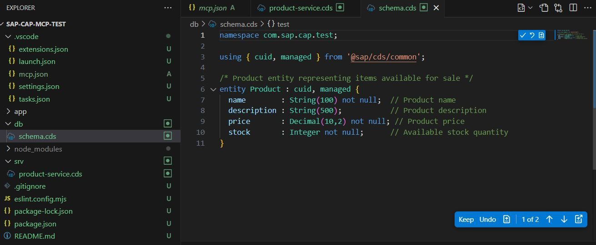
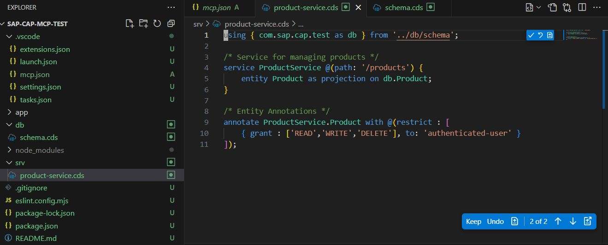
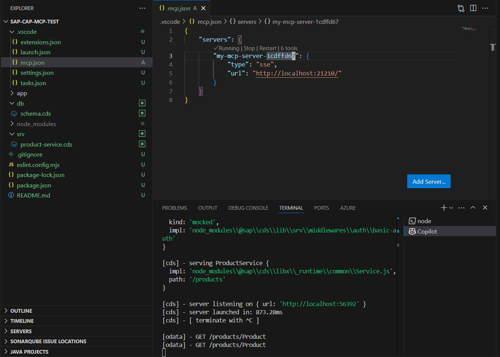

# SAP CAP MCP Server

This is a Model Context Protocol (MCP) server for SAP Cloud Application Programming (CAP) development, providing specialized tools to generate CDS (Core Data Services) schemas and entities.

## Features

- Generate empty CDS schema files with proper namespace and imports
- Create fully featured SAP CAP entities with properties and associations
- Support for managed entities with automatic timestamps and user tracking
- Tools accessible through the Model Context Protocol

## Deployment as Local Executable

Follow these steps to deploy the SAP CAP MCP server as a self-contained local executable with all dependencies embedded:

### Prerequisites

- .NET SDK 8.0 or later
- Windows, macOS, or Linux operating system

### Build Steps

1. **Clone the repository**

   ```bash
   git clone <repository-url>
   cd sap-cap-mcp
   ```

2. **Build as self-contained executable**

   For Windows:
   ```cmd
   dotnet publish -c Release -r win-x64 --self-contained true /p:PublishSingleFile=true
   rm -r ./deploy/*.*
   cp ./bin/Release/net8.0/win-x64/publish/sap-cap-mcp.exe ./deploy
   cp ./bin/Release/net8.0/win-x64/publish/appsettings.json ./deploy
   ```

By default, the server runs on port 21210, change config for other port

# Prompts

Work with these sample prompts

1. `instruction for sap cap development`
2. `init sap cap structure`
3. `create 1 entity Product and expose it in cds service using tools`
4. `start sap cap cds development`

# Add MCP Tool Server code

Run `sap-cap-mcp.exe`
In .vscode/mcp.json file put and check all tools from the server
```
{
    "servers": {
        "my-mcp-server-1cdffd67": {
            "type": "sse",
            "url": "http://localhost:21210/"
        }
    }
}
```

# Media pictures and video

## Screenshots

Here are some screenshots of the SAP CAP MCP Server in action:





## Demo

Watch our demo to see how to use the SAP CAP MCP Server:

[SAP CAP MCP Server Demo](./docs/sap-cap-mcp-demo.mp4)
